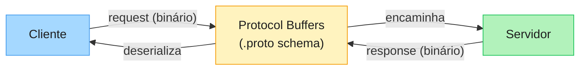
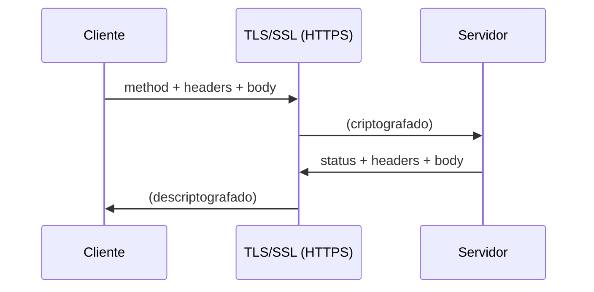
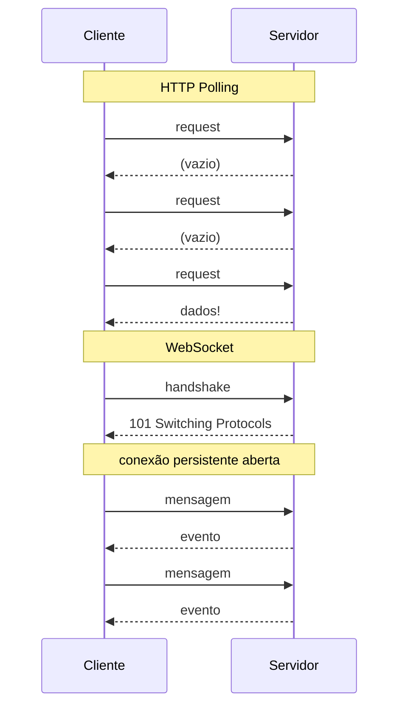
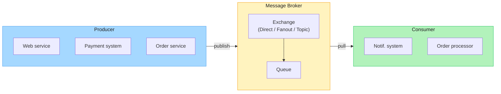
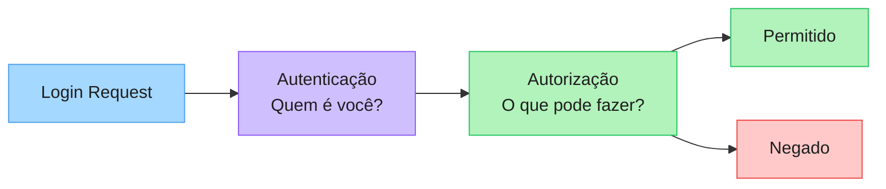
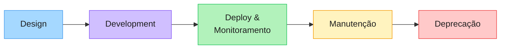

# Design de APIs: Referência Técnica

## O que é uma API?

Uma API (Application Programming Interface) define como componentes de software devem se comunicar. Pensa nela como um contrato: especifica o que pode ser solicitado, como fazer isso e o que esperar de volta.

Dois conceitos centrais aqui:

- **Abstração** — esconde os detalhes de implementação e expõe só o que o outro lado precisa saber
- **Fronteiras de serviço** — define onde um sistema começa e o outro termina

---

## Estilos de API

### REST

O mais comum. Organizado em torno de recursos com métodos HTTP padrão. Cada requisição carrega tudo que o servidor precisa — sem estado compartilhado entre chamadas. Funciona bem para web e mobile na grande maioria dos casos.

### GraphQL

Criado pelo Facebook para resolver um problema específico: clientes fazendo várias requisições e ainda assim recebendo dados que não precisavam. A solução foi dar ao cliente o controle sobre o que buscar.

Tem um único endpoint. O cliente define a forma dos dados usando:

- `query` — leitura
- `mutation` — escrita
- `subscription` — tempo real

### gRPC

Alta performance. Usa Protocol Buffers para serialização binária e HTTP/2 para transporte. O protocolo ideal para comunicação entre microserviços internos onde latência importa.



> Ideal para microserviços internos onde latência importa. Não use em browsers sem proxy intermediário.

---

## Princípios de Design

Antes de qualquer decisão técnica, quatro coisas precisam estar claras:

**Consistência** — nomenclatura e padrões precisam ser previsíveis. Um dev que lê um endpoint deve conseguir adivinhar como os outros funcionam.

**Simplicidade** — foca nos casos de uso centrais. API boa não tenta fazer tudo.

**Segurança** — autenticação, autorização, validação de entrada e rate limiting. Não são detalhes de implementação, são parte do design.

**Performance** — paginação, cache e payloads mínimos. Reduzir round trips é sempre melhor do que otimizar depois.

---

## Protocolos de Transporte

### HTTP e HTTPS

HTTP é o protocolo base: cliente envia `method + headers + body`, servidor responde no mesmo formato. HTTPS adiciona TLS em cima, protegendo os dados em trânsito.



Sem HTTPS você está exposto a man-in-the-middle, adulteração de dados e perda de confiança do usuário. Com HTTPS: dados criptografados, integridade garantida, identidade do servidor verificada.

### WebSocket

HTTP polling desperdiça banda com respostas vazias e aumenta a latência. WebSocket mantém uma conexão aberta e permite comunicação bidirecional. O caminho certo para chat, notificações em tempo real e feeds ao vivo.



### AMQP

Comunicação assíncrona via fila. Um Producer publica a mensagem, o Message Broker gerencia a fila, o Consumer processa quando estiver disponível. Útil para sistemas de notificação, processamento de ordens e qualquer coisa que não precise de resposta imediata.



> O producer não espera resposta imediata. O consumer processa quando estiver disponível.

### TCP vs UDP

A pergunta é simples: todos os dados precisam chegar?

- **TCP** — entrega garantida, com handshake e reordenação de pacotes. Mais lento, mas confiável. Para pagamentos e transações.
- **UDP** — sem garantia, sem handshake. Rápido. Para jogos online, videochamadas e interações em tempo real onde perder alguns pacotes é aceitável.

---

## REST na Prática

### Modelagem de Recursos

Converte entidades do domínio em substantivos plurais no formato URL:

```
Produto → /api/v1/products
Pedido  → /api/v1/orders
Review  → /api/v1/products/{id}/reviews
```

### Filtragem, Ordenação e Paginação

Sempre via query params:

```
GET /products?category=books&inStock=true
GET /products?sort=price&order=asc&page=2&limit=20
```

Esses três juntos reduzem banda, melhoram performance e dão mais flexibilidade pro frontend.

### Métodos HTTP

| Método | CRUD | Seguro | Idempotente |
|--------|------|--------|-------------|
| GET | Read | Sim | Sim |
| POST | Create | Não | Não |
| PUT | Update completo | Não | Sim |
| PATCH | Update parcial | Não | Não |
| DELETE | Delete | Não | Sim |

> **Seguro** significa que não muda o estado do servidor. **Idempotente** significa que repetir a mesma requisição tem o mesmo efeito que fazê-la uma vez.

### Códigos de Status

Não invente. Use o padrão:

- `200 OK` — funcionou
- `201 Created` — recurso criado
- `204 No Content` — funcionou, sem corpo na resposta
- `400 Bad Request` — erro do cliente
- `401 Unauthorized` — não autenticado
- `404 Not Found` — recurso não existe
- `5xx` — erro do servidor

### Boas Práticas REST

- Substantivos plurais nas URLs
- Hierarquia clara e consistente
- Versiona desde o começo (`/api/v1/`)
- Suporte a filtering, sorting e pagination

---

## GraphQL na Prática

### Schema e Tipos

O schema define tudo que a API pode fazer:

```graphql
type User {
  id: ID!
  name: String!
  email: String!
}

type Query {
  user(id: ID!): User
}
```

### Query

Leitura. Não modifica estado:

```graphql
query {
  user(id: "1") {
    id
    name
    email
  }
}
```

### Mutation

Escrita, atualização ou deleção:

```graphql
mutation {
  createUser(name: "Ana", email: "ana@email.com") {
    id
    name
  }
}
```

### Subscription

Eventos em tempo real:

```graphql
subscription {
  userCreated {
    id
    name
  }
}
```

### Boas Práticas GraphQL

- Schemas pequenos — adiciona campo por campo conforme a necessidade
- Limite de profundidade de query para evitar consultas absurdas
- Nomeia tudo de forma intuitiva
- Usa input types para mutations complexas

---

## Autenticação vs Autorização

Esses dois são frequentemente confundidos, mas respondem perguntas diferentes:

- **Autenticação** — *quem é você?*
- **Autorização** — *o que você pode fazer?*

A autenticação sempre vem primeiro.



### Mecanismos de Autenticação

**Basic Auth** — usuário e senha encodados em Base64. Simples, mas inseguro sem HTTPS. Não usa em produção sem TLS.

**Bearer Token** — padrão atual para APIs. Stateless e rápido. O cliente envia o token no header, o servidor valida.

**OAuth2 + JWT** — para cenários de "Login com Google/GitHub". O JWT carrega as claims do usuário e não precisa de sessão no servidor. O access token tem vida curta; o refresh token renova sem precisar que o usuário faça login de novo.

**SSO (Single Sign-On)** — um único login para vários sistemas. Usa protocolos de identidade para trocar informações de autenticação entre aplicações de forma segura.

### Modelos de Autorização

**RBAC (Role-Based Access Control)** — o mais comum. Atribui roles como `admin`, `editor`, `viewer`. Simples de implementar e entender.

**ABAC (Attribute-Based Access Control)** — mais granular. Acesso baseado em atributos do usuário e do recurso. Mais flexível, mais complexo de manter.

---

## Processo de Design de APIs

Três abordagens, cada uma com um contexto diferente:

1. **Top-down** — começa pelos requisitos de negócio e workflows. O mais pedido em entrevistas.
2. **Bottom-up** — começa nos modelos de dados existentes. Útil quando a infraestrutura já existe.
3. **Contract-first** — define o contrato antes de qualquer implementação. Favorece times que trabalham em paralelo (frontend e backend).

### Ciclo de Vida



Deprecação é parte do design. Planeja como vai comunicar mudanças antes de precisar fazer isso em produção.

---

## Como Escolher o Protocolo Certo

Cinco perguntas para tomar essa decisão:

1. **Padrão de interação** — request-response ou tempo real?
2. **Requisitos de performance** — latência importa o suficiente para justificar gRPC?
3. **Compatibilidade do cliente** — browsers têm suporte limitado para alguns protocolos
4. **Volume de dados** — payloads grandes pedem protocolos com melhor compressão
5. **Segurança** — quais requisitos de criptografia e autenticação existem?

Protocolo é uma decisão de design, não de implementação. Muda depois custa caro.